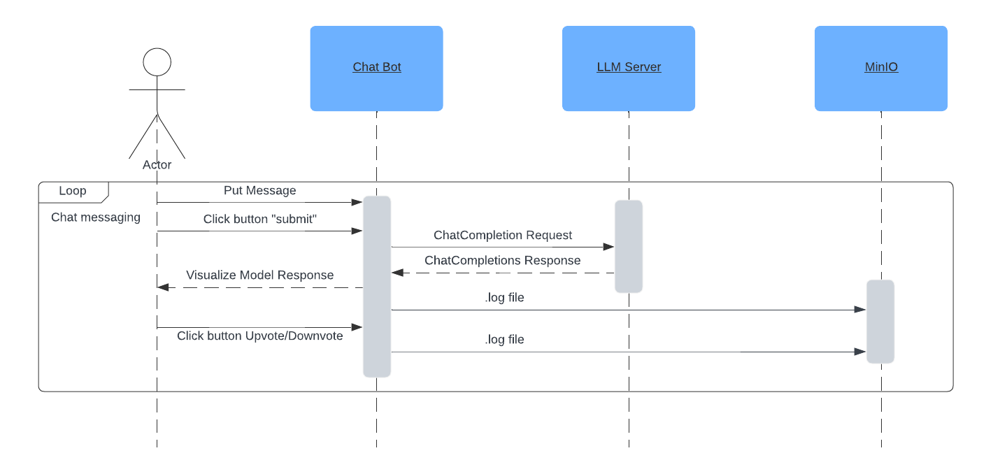

# chatbot-evaluation

## Architecture Diagram


## Sequence Diagram


## Set up
For setting up the chatbot evaluation, you need to:
1. Download model in GGUF from [huggingface](https://huggingface.co/TheBloke/CapybaraHermes-2.5-Mistral-7B-GGUF/tree/main) and move in to `chatbot-evaluation/models` directory.
2. Create .env file in the directory with the following content (example in the .env.example file):


```bash
# api key for the model rest api
API_KEY=key
# model name
MODEL_NAME=/models/capybarahermes-2.5-mistral-7b.Q2_K.gguf
# minio credentials
MINIO_ROOT_USER=user1111
MINIO_ROOT_PASSWORD=password1111
# minio bucket where logs are stored
MINIO_BUCKET=logging
# stop words for the model
STOP_WORDS='["<|im_start|>", "<|im_end|>"]'

# port forwarding for the services
APP_PORT=9090
MODEL_API_PORT=9081
MINIO_PORT=9010

# path to the model volume 
MODEL_VOLUME_PATH=/home/chatbot-evaluation/models
```

3. Run the following command to start the services:
```bash
docker-compose build
docker-compose --env-file .env up
```

